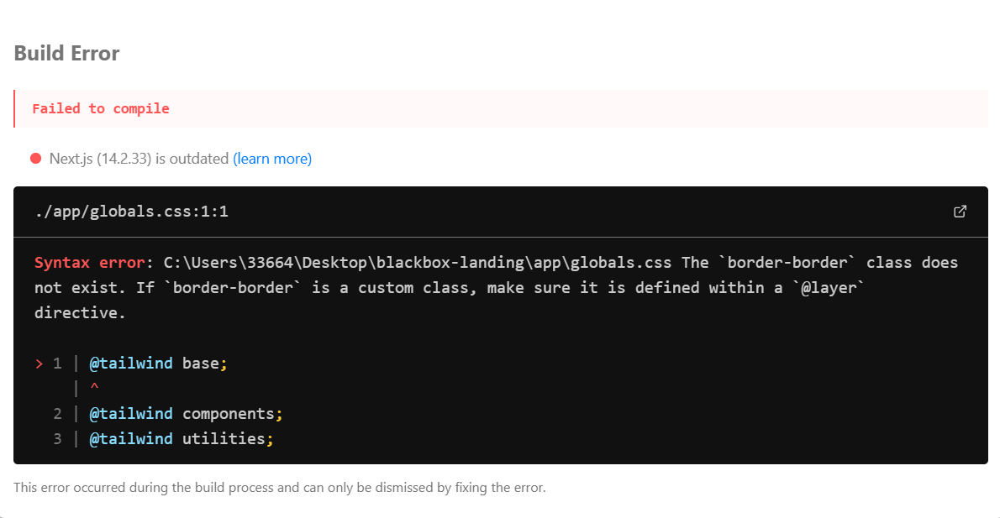

](image.png)# 🧠 Blackbox Quantum Landing Page

Landing page minimaliste, performante et futuriste inspirée de firecrawl.dev.

## 🚀 Stack Technique

- **Next.js 14** (App Router)
- **Tailwind CSS** pour le styling
- **Framer Motion** pour les animations
- **TypeScript** pour la sécurité des types
- **100% Client-Side** - Pas de backend requis

## ✨ Fonctionnalités

- 🎨 Design glassmorphism avec gradients quantum
- 💬 Chat conversationnel client-side avec localStorage
- 🎯 Routing d'intents par mots-clés (pricing, features, stack, etc.)
- ⚡ Optimisé pour Core Web Vitals
- ♿ Accessible (contrastes WCAG conformes)
- 📱 Responsive design
- 🌙 Effets visuels subtils : scanlines, aurora beam, spotlight

## 📦 Installation

```bash
# Installer les dépendances
npm install

# Lancer le serveur de développement
npm run dev
```

Ouvrez [http://localhost:3000](http://localhost:3000) dans votre navigateur.

## 🎨 Couleurs Principales

- **Background**: `#0B0B1D` (Bleu nuit profond)
- **Accent**: `#47F273` (Émeraude vibrant)

## 📂 Structure du Projet

```
blackbox-landing/
├── app/
│   ├── layout.tsx       # Layout racine avec métadonnées SEO
│   ├── page.tsx         # Page principale (landing)
│   └── globals.css      # Styles globaux Tailwind
├── public/              # Assets statiques
├── package.json         # Dépendances
├── tailwind.config.ts   # Configuration Tailwind
├── tsconfig.json        # Configuration TypeScript
└── next.config.js       # Configuration Next.js
```

## 🎯 Sections de la Landing Page

1. **Nav** - Navigation sticky avec glassmorphism
2. **Hero** - Section héro avec titre animé et CTAs
3. **How It Works** - Processus en 3 étapes
4. **Features Dev** - 4 fonctionnalités principales
5. **Live Demo** - Chat conversationnel + snippet de docs
6. **CTA** - Call-to-action final
7. **Footer** - Liens et copyright

## 💬 Chat Conversationnel

Le chat utilise un système d'intents basé sur des mots-clés :

- `pricing` / `tarif` → Informations sur les prix
- `features` / `fonctions` → Liste des fonctionnalités
- `stack` / `tech` → Stack technique
- `docs` / `documentation` → Guide quickstart
- `privacy` / `rgpd` → Politique de confidentialité
- `performance` / `speed` → Optimisations

Les conversations sont sauvegardées dans `localStorage` et persistent entre les sessions.

## 🛠️ Scripts Disponibles

```bash
npm run dev      # Serveur de développement
npm run build    # Build de production
npm run start    # Serveur de production
npm run lint     # Linter ESLint
```

## 🎨 Personnalisation

### Modifier les couleurs

Éditez `tailwind.config.ts` :

```typescript
theme: {
  extend: {
    colors: {
      background: '#0B0B1D',  // Votre couleur de fond
      accent: '#47F273',       // Votre couleur d'accent
    },
  },
}
```

### Ajouter des intents au chat

Dans `app/page.tsx`, fonction `ChatWidget` → `generateAnswer()` :

```typescript
const intents = [
  {
    key: "votre-intent",
    match: /mot-clé|autre-mot/i,
    answer: () => "Votre réponse ici",
  },
  // ... autres intents
];
```

## 📈 Performance

- ✅ Animations GPU-accelerated
- ✅ Pas d'images lourdes (gradients CSS)
- ✅ Code splitting automatique (Next.js)
- ✅ Lazy loading des sections
- ✅ Optimisation des fonts (next/font)

## 🌐 Déploiement

### Vercel (Recommandé)

```bash
# Installer Vercel CLI
npm i -g vercel

# Déployer
vercel
```

### Autres plateformes

```bash
# Build
npm run build

# Le dossier .next/ contient votre application
```

## 📝 Licence

© 2025 Blackbox Quantum — Fait pour vendre sans friction.

## 🤝 Contribution

Ce projet est un template de landing page. N'hésitez pas à le forker et l'adapter à vos besoins !

---

**Made with 🧠 by Blackbox Quantum**
